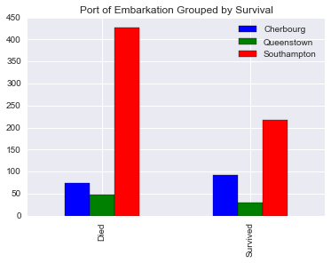
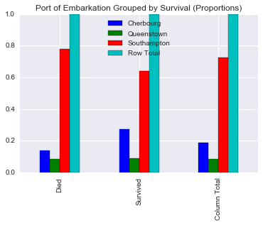
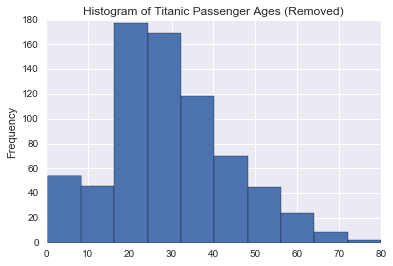
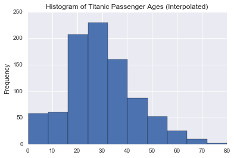

```python
import numpy as np
import pandas as pd
import matplotlib.pyplot as plt
import seaborn as sns
import scipy.stats as sp
%pylab inline

titanic_df = pd.read_csv('titanic_data.csv')
titanic_df.head()
```

    Populating the interactive namespace from numpy and matplotlib
    


<div>
<table border="1" class="dataframe">
  <thead>
    <tr style="text-align: right;">
      <th></th>
      <th>PassengerId</th>
      <th>Survived</th>
      <th>Pclass</th>
      <th>Name</th>
      <th>Sex</th>
      <th>Age</th>
      <th>SibSp</th>
      <th>Parch</th>
      <th>Ticket</th>
      <th>Fare</th>
      <th>Cabin</th>
      <th>Embarked</th>
    </tr>
  </thead>
  <tbody>
    <tr>
      <th>0</th>
      <td>1</td>
      <td>0</td>
      <td>3</td>
      <td>Braund, Mr. Owen Harris</td>
      <td>male</td>
      <td>22</td>
      <td>1</td>
      <td>0</td>
      <td>A/5 21171</td>
      <td>7.2500</td>
      <td>NaN</td>
      <td>S</td>
    </tr>
    <tr>
      <th>1</th>
      <td>2</td>
      <td>1</td>
      <td>1</td>
      <td>Cumings, Mrs. John Bradley (Florence Briggs Th...</td>
      <td>female</td>
      <td>38</td>
      <td>1</td>
      <td>0</td>
      <td>PC 17599</td>
      <td>71.2833</td>
      <td>C85</td>
      <td>C</td>
    </tr>
    <tr>
      <th>2</th>
      <td>3</td>
      <td>1</td>
      <td>3</td>
      <td>Heikkinen, Miss. Laina</td>
      <td>female</td>
      <td>26</td>
      <td>0</td>
      <td>0</td>
      <td>STON/O2. 3101282</td>
      <td>7.9250</td>
      <td>NaN</td>
      <td>S</td>
    </tr>
    <tr>
      <th>3</th>
      <td>4</td>
      <td>1</td>
      <td>1</td>
      <td>Futrelle, Mrs. Jacques Heath (Lily May Peel)</td>
      <td>female</td>
      <td>35</td>
      <td>1</td>
      <td>0</td>
      <td>113803</td>
      <td>53.1000</td>
      <td>C123</td>
      <td>S</td>
    </tr>
    <tr>
      <th>4</th>
      <td>5</td>
      <td>0</td>
      <td>3</td>
      <td>Allen, Mr. William Henry</td>
      <td>male</td>
      <td>35</td>
      <td>0</td>
      <td>0</td>
      <td>373450</td>
      <td>8.0500</td>
      <td>NaN</td>
      <td>S</td>
    </tr>
  </tbody>
</table>
</div>


Methods for creating one-way and two-way tables were modified from [Python for Data Analysis Part 19: Frequency Tables](http://hamelg.blogspot.com/2015/11/python-for-data-analysis-part-19_17.html)

This project focuses on an analysis of the Titanic data.

# Question Phase
## Possible Questions
1) Is there a relationship between survival and port of embarkation?   
2) Do people who embark at the different ports have anything in common?   
3) Is there anything interesting to note about passenger ages?

# Wrangle/Explore Phase

The data was read in from the provided csv file.   

Since the main variables of interest are survival, point of embarkation, and age, these columns in the csv will be analyzed and cleaned to handle any missing values.

Any points of embarkation that are missing will be dropped from the table since there is no discernible way to determine what port a passenger came from based on this data.  This only affects 2 of the rows.

Several of the rows in the csv file did not contain ages for the passengers.  Two methods of handling these missing ages will be used in the analysis.


```python
print "Records in original csv:",len(titanic_df)

# Create DataFrame with Point of Embarkation mising values removed
titanic_missing_embark_removed_df = titanic_df.dropna(subset = ['Embarked'])
print "Records after removing missing ports of embarkation:",len(titanic_missing_embark_removed_df)

# Create DataFrame with ages handled -- remove any missing / use interpolation
ages_missing_removed_df = titanic_df['Age'].dropna()
print "Records after removing missing ages:",len(ages_missing_removed_df)

ages_missing_removed_interpolation_df = titanic_df['Age'].interpolate()
print "Records when interpolating ages:",len(ages_missing_removed_interpolation_df)


```

    Records in original csv: 891
    Records after removing missing ports of embarkation: 889
    Records after removing missing ages: 714
    Records when interpolating ages: 891
    

The first two tables below show a general summary of the passenger survival and passenger port of embarkation.


```python
survived_table = pd.crosstab(index = titanic_missing_embark_removed_df['Survived'], columns = 'Count')
print survived_table
print survived_table / survived_table.sum()
```

    col_0     Count
    Survived       
    0           549
    1           340
    col_0        Count
    Survived          
    0         0.617548
    1         0.382452
    


```python
embark_table = pd.crosstab(index = titanic_missing_embark_removed_df['Embarked'], columns = 'Count')
print embark_table
print embark_table / embark_table.sum()
```

    col_0     Count
    Embarked       
    C           168
    Q            77
    S           644
    col_0        Count
    Embarked          
    C         0.188976
    Q         0.086614
    S         0.724409
    

The important information to note from these two tables is that 61.75% of all of the passengers did not survive.  Based on the second table grouped by embark location, it appears that the majority (72.44%) of the passengers embarked at Southampton.  The smallest percentage of passengers (8.66%) embarked at Queenstown.

The next part of exploring the data involved creating a two-way table to analyze any relationship between survival and port of embarkation.


```python
survived_by_embark_table = pd.crosstab(index = titanic_missing_embark_removed_df['Survived'], 
                                       columns = titanic_missing_embark_removed_df['Embarked'], margins = True)
survived_by_embark_table.index = ['Died', 'Survived', 'Column Total']
survived_by_embark_table.columns = ['Cherbourg', 'Queenstown', 'Southampton', 'Row Total']
print survived_by_embark_table
print
survived_by_embark_table_expected = pd.DataFrame(sp.chi2_contingency(survived_by_embark_table)[3], 
                                                 columns = ['Cherbourg', 'Queenstown', 'Southampton', 'Row Total'],
                                                 index = ['Died', 'Survived', 'Column Total'])
print survived_by_embark_table_expected

# First table is observed
# Second table is expected
```

                  Cherbourg  Queenstown  Southampton  Row Total
    Died                 75          47          427        549
    Survived             93          30          217        340
    Column Total        168          77          644        889
    
                   Cherbourg  Queenstown  Southampton  Row Total
    Died          103.748031   47.551181   397.700787        549
    Survived       64.251969   29.448819   246.299213        340
    Column Total  168.000000   77.000000   644.000000        889
    

The first table shows the actual data grouped by survival and port of embarkation.  The second table shows the expected values for the table if there was no relationship between survival and port of embarkation.  I used a chi-square test function in order go generate this table (no statistical test will actually be used in this analysis).  For example, since there were 77 passengers who embarked at Queenstown, this means that 8.66% (77 / 889) of all passengers embarked at Queenstown.  If the port of embarkation did not have some type of relationship with whether or not a passenger survived, one would expect that 8.6% of all those who died or survived would be represented from passengers who embarked at Queenstown.  This is exactly what the expected table is showing (47.55 / 549 ~ 8.66% and 29.45 / 340 ~ 8.66%).

A basic bar chart is created to examine the counts shown in the two-way table between survival and port of embarkation.


```python
survived_by_embark_table_no_margins = pd.crosstab(index = titanic_missing_embark_removed_df['Survived'], 
                                                  columns = titanic_missing_embark_removed_df['Embarked'])
survived_by_embark_table_no_margins.index = ['Died', 'Survived']
survived_by_embark_table_no_margins.columns = ['Cherbourg', 'Queenstown', 'Southampton']
survived_by_embark_table_no_margins.plot(kind = 'bar', title = 'Port of Embarkation Grouped by Survival')
```


    <matplotlib.axes._subplots.AxesSubplot at 0x121c9358>





Since this chart includes the raw counts from the table, it is harder to make comparisons.  For example, one can see that there are a lot of Southampton passengers who died; however, it is difficult to tell if this raises any concerns since a majority of the passengers embarked at Southampton.

A better way to analyze the data is to create a table that displays the proportion of counts along each row.  This will allow one to answer questions related to the survival such as, "Of the passengers who died, what proportion embarked at Southampton?"


```python
survived_by_embark_table_proportions = survived_by_embark_table.div(survived_by_embark_table['Row Total'], axis = 0)
print survived_by_embark_table_proportions
```

                  Cherbourg  Queenstown  Southampton  Row Total
    Died           0.136612    0.085610     0.777778          1
    Survived       0.273529    0.088235     0.638235          1
    Column Total   0.188976    0.086614     0.724409          1
    

This shows that of all the passengers who did not survive, 13.66% embarked at Cherbourg, 8.56% embarked at Queenstown, and 77.78% embarked at Southampton.

The following table shows the expected proportions.


```python
survived_by_embark_table_expected_proportions = survived_by_embark_table_expected.div(
                                                    survived_by_embark_table_expected['Row Total'], axis = 0)
print survived_by_embark_table_expected_proportions
```

                  Cherbourg  Queenstown  Southampton  Row Total
    Died           0.188976    0.086614     0.724409          1
    Survived       0.188976    0.086614     0.724409          1
    Column Total   0.188976    0.086614     0.724409          1
    

It is interesting to note here that this table shows why these values would be expected if there were no relationship between surival and port of embarkation.  A cursory analysis which would need to be verified with further statistical tests shows can be completed.  It appears that there are discrepancies in the passengers who embarked at Cherbourg and Southampton.

A bar chart of the proportions can be created to get a better look at the data.


```python
survived_by_embark_table_proportions.plot(kind = 'bar', title = 'Port of Embarkation Grouped by Survival (Proportions)')
```


    <matplotlib.axes._subplots.AxesSubplot at 0x1194fe48>





Since the vertical axis of this bar chart is frequency, comparisons can be made that are more meaningful.  For example, it is easy to see that the proportion of those who died is lower in passengers who embarked at Cherbourg.  One can also see that the proportion of those who died is higher in passengers who embarked at Southampton.  There is no discernible difference between the proportion of survival for passengers who embarked at Queenstown.

Since there does appear to be some kind of relationship between survival and port of embarkation, it may be worthwhile to look into the port of embarkation variable further.  The first thought that came to mind was to analyze the passenger class and its relationship with port of embarkation.  Tables summarizing this relationship are below.


```python
embark_by_class_table = pd.crosstab(index = titanic_missing_embark_removed_df['Embarked'], 
                                    columns = titanic_missing_embark_removed_df['Pclass'], margins = True)
embark_by_class_table.index = ['Cherbourg', 'Queenstown', 'Southampton', 'Column Total']
embark_by_class_table.columns = ['1st Class', '2nd Class', '3rd Class', 'Row Total']
print embark_by_class_table
print
print embark_by_class_table.div(embark_by_class_table['Row Total'], axis = 0)
```

                  1st Class  2nd Class  3rd Class  Row Total
    Cherbourg            85         17         66        168
    Queenstown            2          3         72         77
    Southampton         127        164        353        644
    Column Total        214        184        491        889
    
                  1st Class  2nd Class  3rd Class  Row Total
    Cherbourg      0.505952   0.101190   0.392857          1
    Queenstown     0.025974   0.038961   0.935065          1
    Southampton    0.197205   0.254658   0.548137          1
    Column Total   0.240720   0.206974   0.552306          1
    

Two interesting details jump out from the table of row proportions.  First, 50.60% of the Cherbourg passengers are 1st Class passengers.  Second, 54.81% of the Southampton passengers are 3rd Class passengers.  Another interesting observation is that a large percentage of the Queenstown passengers were 3rd Class. 

Histograms of the data with the ages removed and the ages interpolated were created in order to analyze any interesting patterns within the ages of the passengers.


```python
ages_missing_removed_df.plot(kind = 'hist', title = 'Histogram of Titanic Passenger Ages (Removed)')
ages_missing_removed_df.describe()
```


    count    714.000000
    mean      29.699118
    std       14.526497
    min        0.420000
    25%       20.125000
    50%       28.000000
    75%       38.000000
    max       80.000000
    Name: Age, dtype: float64





```python
ages_missing_removed_interpolation_df.plot(kind = 'hist', title = 'Histogram of Titanic Passenger Ages (Interpolated)')
ages_missing_removed_interpolation_df.describe()
```


    count    891.000000
    mean      29.726061
    std       13.902353
    min        0.420000
    25%       21.000000
    50%       28.500000
    75%       38.000000
    max       80.000000
    Name: Age, dtype: float64





The shape of the histogram is generally mound-shaped; however, it could be considered skewed slightly to the right (the mean is slightly higher than the median).  50% of the ages fall within the range of approximately 20 years to 38 years.  The youngest passengers was approximately 6 months old.  The oldest passenger was 80 years old.

For comparison, the histogram for the data with interpolation used for the ages is displayed.  There are some minor differences with the summary statistics and shape of the histogram.  The histogram appears to be a bit more mound=shaped.  The median and mean are a little closer than for the histogram with the ages removed.  A minor change to the middle 50% of the data is evident due to its range being from 21 years to 38 years.

Further analysis as to the best method of handling missing ages is needed.  For example, instead of using the built-in interpolation function, a method of using other data in the set (such as the number of siblings or parents) could be used to devise a more accurate value for the age of the passenger.

# Conclusions
Based on the previous exploration and analysis, there does appear to be a relationship between survival and port of embarkation.  A larger than expected proportion of passengers who survived embarked at Cherbourg.  A larger than expected proportion of passengers who did not survive embarked at Southampton.  Another aspect of the analysis indicates that there is some type of relationship between port of embarkation and the class of the passenger.  About half of the passengers who embarked at Cherbourg were 1st class, and little more than half of the passengers who embarked at Southampton were 3rd class. This may indicate that there is also some type of relationship between the class of the passenger and survival rate (i.e. since a larger than expected percentage of passengers who did not survive embarked at Southampton, there may be something to the fact that most of these passengers were 3rd class).  An interesting observation is that the majority of passengers who embarked at Queenstown (93.51%) were 3rd class; however, the survival rates for these passengers were close to what would be expected.  A possible reason for this is that there were relatively few passengers who embarked at Queenstown.  77 passengers embarked at Queenstown which represented 8.66% of all passengers.  Since this is a small sample, one can expect to possibly obtain results that are more random or have more noise in the data.

The ages of the passengers appears to be roughly normally distributed with 50% of the passengers being between the ages of 20 and 38 years of age.

Further analysis to determine the statistical significance of these relationships is needed.  Relying solely on statistical measures such as the mean, median, or proportions in tables is problematic because these methods do not account for any inherent random variation within the data.  Proper statistical tests help account for this naturally occurring random variation in order to help discern a signal from the noisy/random data.  For example, a chi-squared test for independence could be conducted to examine the relationship between survival and point of embarkation.  The null hypothesis of this test would be that survival and point of embarkation are independent.  The alternative hypothesis would be that these variables are not independent.  Basically, it is assumed that these variables do not effect each other.  The test is run on the actual data to see if there is enough evidence to support a relationship.  Results of this test are below.


```python
sp.chi2_contingency(survived_by_embark_table)
print "Chi-squared test statistic:",sp.chi2_contingency(survived_by_embark_table)[0]
print "P-value:",sp.chi2_contingency(survived_by_embark_table)[1]
```

    Chi-squared test statistic: 26.4891498392
    P-value: 0.000180450581016
    

With a p-value so small (p < 0.05), there is strong evidence to reject the null hypothesis that survival and port of embarkation are independent.  The data suggests that there is a relationship between survival and port of embarkation.

As noted earlier, the way missing ages are handled could be refined.  Using other techniques (such as machine learning) and other variables within the data set, ages could be determined.


```python
#titanic_df.plot(x = 'SibSp', y = 'Age', kind = 'scatter')

```


```python

```
